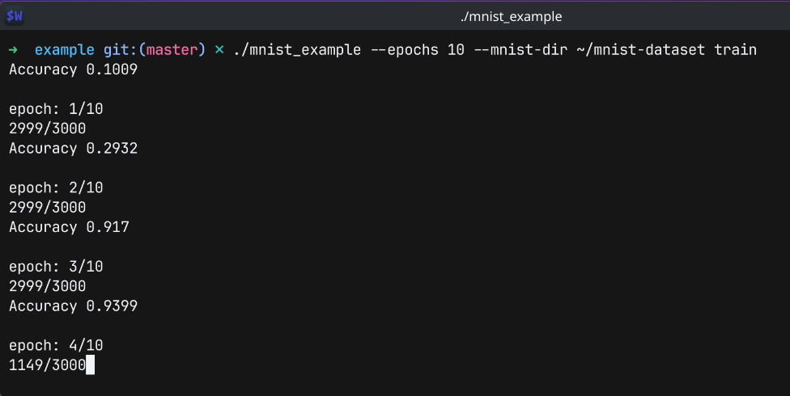
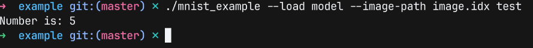

# nueralnet
GitHub project that includes a neural network library with customizable layers, activations and minibatch based SGD trainer with customizable training hyperparameters.
Also includes an example program to create a datapipline and utilize the network library to create a sigmoid and MSE based classifier of the MNIST handwritten digits.
Achieves up to 98.2% accuracy on the MNIST handwritten test set. Includes a python drawing pad to test the classifier.

# Images 
<table>
  <tr>
    <td valign="top" width="33%">
      
      
    </td>
    <td valign="top" width="25%">
      
    </td>
  </tr>
</table>


# Features and Performance of Sigmoid/MSE Network on MNIST
The project includes an example program to train a Sigmoid/MSE configuration of the library on the MNIST handwritten digit dataset.

Achieves an accuracy of 98.2% when running with higher parameter counts and slower learning rates to delay convergence. 

With more balanced hyperparameters and layer sizes, it is able to achieve an accuracy of 97.5%+ 
while reaching convergence in less than one minute, on a Ryzen 7 5800H.

Comparison of network accuracy on MNIST test set vs other techniques. Information 
courtesy of wikipedia. https://en.wikipedia.org/wiki/MNIST_database.
| Algorithm                          |  Training on Synthetic/Augmented Data?  | MNIST Accuracy |
| -------------                      |  -------------------------------------  | -------------  |
| Linear Classifier                  | No Training                             | 92.4           |
| Non-Linear Classifier              | No Training                             | 96.7           |
| This Project  (3-layer)            | no                                      | 98.2           |
| Other Network (2-layer)            | no                                      | 98.4           |
| Other Network (6-layer)            | yes                                     | 99.65          |
| CNN (13-layer)                     | no                                      | 99.75          |
| CNN (3 CNN Ensemble)               | yes                                     | 99.91          |

## List of Features
- Python drawing pad GUI allowing for easily testing inference on custom digits.
- Minibatch based SGD trainer with customizable batch sizes, epochs and learning rate.
    Achieves convergence at least 10 times faster than a simpler non-batched trainer.
- Vectorized backpropagation and inference using xtensor methods and BLAS based matrix multiplication operations.
- Customizable number of layers and layer sizes.
- Customizable activation functions for newtork layers.
- Saving and loading of network.
- Initilization/Saving/Loading/Training and all customization done through library API that
    can be either statically or dynamically linked with applications.
- Layer weights and biases are saved as csv files, allowing for easily extendable and human-readable model saves.

# Building and Running
This project uses cmake to build both the network library and the MNIST example application.

Requires xtensor and xtensor-blas to be available as cmake compatable libraries.
The following sections describe different ways of making those libraries available to cmake.

## Using Vcpkg (Cross-Platform Instructions)
1. Install xtensor and xtensor-blas using vcpkg.</br>
```vcpkg install xtensor xtensor-blas```

3. Create a build directory and cd into it.</br>
```mkdir build && cd build```

5. Invoke cmake in release mode, and link to vcpkg installation.</br>
```cmake ../ -DCMAKE_TOOLCHAIN_FILE=$VCPKG_ROOT/scripts/buildsystems/vcpkg.cmake```

7. Build the project using the generated build files.</br>
(Make) ```make```</br>
(Visual Studio) ``` msbuild project.sln```
